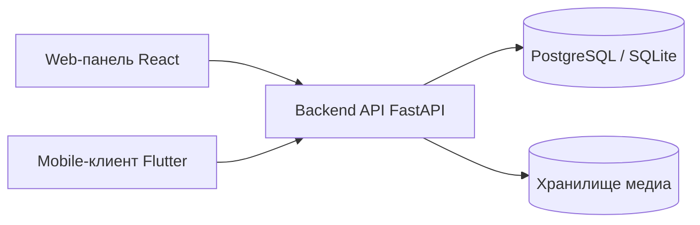

# Corporate LMS MVP

Многотенантная клиент-серверная система корпоративного обучения для ВКР: backend API, web-панель на React и mobile-клиент на Flutter с адаптивным тестированием.

[](https://github.com/your-org/your-repo/actions/workflows/ci.yml)

## Структура монорепозитория

- `backend` — FastAPI + SQLAlchemy + Alembic, модель данных (PostgreSQL/SQLite)
- `web` — панель администратора/преподавателя (React + TypeScript)
- `mobile` — приложение слушателя (Flutter)
- `docs` — архитектура, runbook, стратегия тестирования, ADR

## Архитектура верхнего уровня



## Ключевые возможности

- tenant-изоляция через `tenant_id` и tenant-контекст запроса
- роли: learner, teacher, org_admin, system_admin
- управление курсами, уроками, тестами и вопросами
- назначение курсов пользователям и группам
- адаптивное тестирование со сложностью `1..5`
- рекомендации по слабым темам после завершения попытки
- аналитика по курсам и слушателям
- JWT auth + refresh, аудит, mock-уведомления

## Индекс документации

- `docs/architecture.md` — обзор подсистем и tenant-модели
- `docs/deployment-runbook.md` — порядок деплоя и health-check
- `docs/testing-strategy.md` — слои API/UI/E2E тестирования
- `docs/adr/0001-runtime-schema-and-startup.md` — решение по миграциям и startup
- `CONTRIBUTING.md` — правила внесения изменений
- `CHANGELOG.md` — история изменений

## Запуск backend локально

```bash
cd backend
python -m venv .venv
. .venv/Scripts/activate
pip install -r requirements.txt
copy ..\\.env.example .env
python -m scripts.seed_demo
uvicorn app.main:app --reload
```

API base по умолчанию: `http://localhost:8000/api/v1`

## Запуск через Docker

```bash
docker compose up --build
```

Сервисы:
- backend: `http://localhost:8000`
- web: `http://localhost:8081`
- postgres: `localhost:5432`

Загрузка demo-данных в PostgreSQL:

```bash
docker compose run --rm --profile tools seed
```

Остановка:

```bash
docker compose down
```

Полный сброс volume БД:

```bash
docker compose down -v
```

## Запуск web локально

```bash
cd web
npm install
npm run dev
```

Web URL по умолчанию: `http://localhost:5173`

## Запуск mobile локально

```bash
cd mobile
flutter pub get
flutter run
```

Mobile-клиент не контейнеризован и подключается к локальному backend.

Базовый API для mobile:
- Android emulator: `http://10.0.2.2:8000/api/v1`
- другие локальные цели: `http://localhost:8000/api/v1`

Переопределение API:

```bash
flutter run --dart-define=API_BASE=http://<your-host-ip>:8000/api/v1
```

## Tenant-модель

- production: tenant определяется по поддомену
- local/dev fallback: заголовок `X-Tenant-Code`
- все tenant-bound таблицы хранят `tenant_id`
- защищенные маршруты требуют JWT и активный membership в текущем tenant

## Demo-аккаунты

- system admin: `sysadmin@example.com` / `Password123!`
- tenant admin: `admin@acme.example.com` / `Password123!`
- teacher: `teacher@acme.example.com` / `Password123!`
- learner: `learner1@acme.example.com` / `Password123!`

## Важные API-маршруты

- auth: `POST /auth/register`, `POST /auth/login`, `POST /auth/refresh`, `GET /auth/me`
- tenants: `GET /tenants`, `GET /tenants/current`, `POST /tenants/select`
- users: `GET/POST/PATCH /users`
- courses: `GET/POST /courses`, `GET /courses/{id}`, `POST /courses/{id}/assign`
- lessons: `GET /lessons?course_id=`, `POST /lessons`, `POST /lessons/{id}/progress`
- tests: `GET/POST /tests`, `POST /questions`, `POST /tests/{id}/start`, `GET /attempts/{id}/next-question`, `POST /attempts/{id}/submit-answer`, `POST /attempts/{id}/finish`
- recommendations: `GET /recommendations/me`
- analytics: `GET /analytics/dashboard`, `GET /analytics/course-progress`, `GET /analytics/problem-topics`, `GET /analytics/learners/{id}`

## Тесты

```bash
cd backend
python -m pytest

cd ../web
npm test

cd ../mobile
flutter test
```

## Проверки качества кода

Backend:

```bash
cd backend
python -m ruff check app tests
python -m mypy app/core app/models
python -m pytest -q
```

Web:

```bash
cd web
npm run lint
npm run format:check
npm test
npm run build
```

## E2E UI-тесты (Playwright)

```bash
cd web
npm run test:e2e:install
npm run test:e2e
```

Покрытие E2E включает:
- рендер auth-страницы и login flow
- activity summary и легенду на dashboard
- smoke-навигацию по основным страницам teacher/admin UI

## Allure-отчеты (API + UI)

UI (Playwright) пишет результаты в `allure-results/ui`.

API:

```bash
cd backend
python -m pytest --alluredir ../allure-results/api -q
```

Сборка/открытие UI-отчета:

```bash
cd ../web
npm run allure:ui:generate
npm run allure:ui:open
```

Сборка/открытие общего API+UI отчета:

```bash
cd web
npm run allure:all:generate
npm run allure:all:open
```

## CI

Workflow: `.github/workflows/ci.yml`

- backend: install deps + Ruff + scoped Mypy + Pytest
- web: install deps + ESLint + Prettier check + tests + build

## Smoke-проверка assignments перед релизом

```bash
python backend/scripts/smoke_assignments_endpoint.py \
  --base-url https://<your-host>/api/v1 \
  --token <staff-or-learner-access-token> \
  --tenant-code <tenant-code>
```

Команда должна вывести `OK` и завершиться с кодом `0`.

## Пояснения к защите ВКР

- Адаптивный алгоритм стартует со сложности `3`.
- Верный ответ повышает сложность (`+1`), неверный — понижает (`-1`).
- Слабые темы усиливаются ошибками и медленными ответами.
- Рекомендации формируются на основе слабых тем.
- Архитектура остается монолитной для объяснимости на защите, но разделена на модули.
