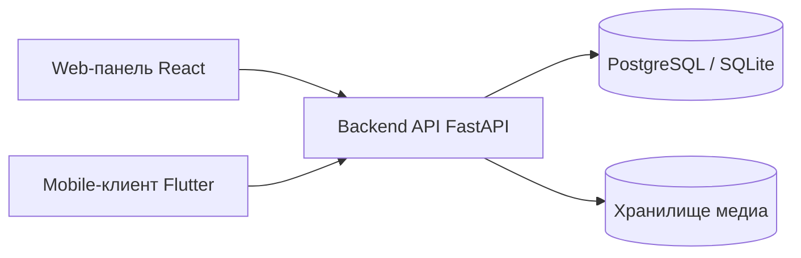

# Coursum LMS

<p>
  
</p>

Coursum LMS — многотенантная клиент-серверная система корпоративного обучения, подготовленная как MVP для ВКР. В репозитории находятся backend API, web-панель администратора/преподавателя и mobile-клиент слушателя.

## Что входит в проект

- `backend` — REST API на FastAPI, SQLAlchemy и Alembic.
- `web` — административная web-панель на React, TypeScript и Vite.
- `mobile` — Flutter-приложение для слушателя.
- `docs` — архитектура, runbook деплоя, стратегия тестирования и ADR.
- `allure-results` / `allure-report` — результаты и отчеты тестов, если они были сгенерированы локально.

## Основные возможности

- изоляция организаций через `tenant_id` и tenant-контекст запроса;
- роли `learner`, `teacher`, `org_admin`, `system_admin`;
- управление пользователями, курсами, уроками, тестами и вопросами;
- назначение курсов пользователям и группам;
- адаптивное тестирование со сложностью вопросов от `1` до `5`;
- рекомендации по слабым темам после завершения попытки;
- аналитика по курсам, слушателям и проблемным темам;
- JWT-авторизация с refresh-токенами;
- аудит действий и расширяемый слой уведомлений;
- UI- и API-тесты, E2E-проверки Playwright, Allure-отчеты.

## Архитектура



Backend является основным источником бизнес-логики и данных. Web-панель используется администраторами и преподавателями, mobile-клиент — слушателями. Все клиенты обращаются к единому REST API и используют общую модель ролей и организаций.

## Быстрый запуск через Docker

```bash
docker compose up --build
```

После запуска доступны:

- backend: `http://localhost:8000`
- web: `http://localhost:8081`
- PostgreSQL: `localhost:5433`

Загрузка демонстрационных данных:

```bash
docker compose run --rm --profile tools seed
```

Остановка контейнеров:

```bash
docker compose down
```

Полный сброс базы данных вместе с volume:

```bash
docker compose down -v
```

## Локальный запуск backend

```bash
cd backend
python -m venv .venv
. .venv/Scripts/activate
pip install -r requirements.txt
copy ..\.env.example .env
python -m scripts.seed_demo
uvicorn app.main:app --reload
```

API по умолчанию: `http://localhost:8000/api/v1`.

## Локальный запуск web

```bash
cd web
npm install
npm run dev
```

Web-панель по умолчанию: `http://localhost:5173`.

## Локальный запуск mobile

```bash
cd mobile
flutter pub get
flutter run
```

Mobile-клиент подключается к локальному backend. Базовый URL API:

- Android emulator: `http://10.0.2.2:8000/api/v1`
- desktop/web и другие локальные цели: `http://localhost:8000/api/v1`

Переопределение API:

```bash
flutter run --dart-define=API_BASE=http://<your-host-ip>:8000/api/v1
```

## Демо-аккаунты

После запуска seed-скрипта доступны пользователи:

| Роль | Email | Пароль |
| --- | --- | --- |
| System admin | `sysadmin@example.com` | `Password123!` |
| Tenant admin | `admin@acme.example.com` | `Password123!` |
| Teacher | `teacher@acme.example.com` | `Password123!` |
| Learner | `learner1@acme.example.com` | `Password123!` |

## Tenant-модель

- В production tenant определяется по поддомену.
- В local/dev режиме можно использовать fallback-заголовок `X-Tenant-Code`.
- Все tenant-bound таблицы хранят `tenant_id`.
- Защищенные маршруты требуют JWT и активное membership в текущей организации.

## Важные API-маршруты

- Auth: `POST /auth/register`, `POST /auth/login`, `POST /auth/refresh`, `GET /auth/me`
- Tenants: `GET /tenants`, `GET /tenants/current`, `POST /tenants/select`
- Users: `GET/POST/PATCH /users`
- Courses: `GET/POST /courses`, `GET /courses/{id}`, `POST /courses/{id}/assign`
- Lessons: `GET /lessons?course_id=`, `POST /lessons`, `POST /lessons/{id}/progress`
- Tests: `GET/POST /tests`, `POST /questions`, `POST /tests/{id}/start`
- Attempts: `GET /attempts/{id}/next-question`, `POST /attempts/{id}/submit-answer`, `POST /attempts/{id}/finish`
- Recommendations: `GET /recommendations/me`
- Analytics: `GET /analytics/dashboard`, `GET /analytics/course-progress`, `GET /analytics/problem-topics`, `GET /analytics/learners/{id}`

## Тесты

Backend:

```bash
cd backend
python -m pytest
```

Web:

```bash
cd web
npm test
```

Mobile:

```bash
cd mobile
flutter test
```

E2E-тесты web-интерфейса:

```bash
cd web
npm run test:e2e:install
npm run test:e2e
```

## Проверки качества

Backend:

```bash
cd backend
python -m ruff check app tests
python -m mypy app/core app/models
python -m pytest -q
```

Web:

```bash
cd web
npm run lint
npm run format:check
npm test
npm run build
```

## Allure-отчеты

API:

```bash
cd backend
python -m pytest --alluredir ../allure-results/api -q
```

UI-отчет:

```bash
cd web
npm run allure:ui:generate
npm run allure:ui:open
```

Общий отчет API + UI:

```bash
cd web
npm run allure:all:generate
npm run allure:all:open
```

## CI

Workflow находится в `.github/workflows/ci.yml`.

CI проверяет backend и web: установку зависимостей, Ruff, Mypy, Pytest, ESLint, Prettier, unit-тесты и сборку web-приложения.

## Smoke-проверка assignments перед релизом

```bash
python backend/scripts/smoke_assignments_endpoint.py \
  --base-url https://<your-host>/api/v1 \
  --token <staff-or-learner-access-token> \
  --tenant-code <tenant-code>
```

Успешный результат: команда выводит `OK` и завершается с кодом `0`.

## Документация

- `docs/architecture.md` — обзор архитектуры, подсистем и tenant-модели.
- `docs/deployment-runbook.md` — порядок деплоя и health-check.
- `docs/testing-strategy.md` — стратегия API, UI и E2E-тестирования.
- `docs/adr/0001-runtime-schema-and-startup.md` — решение по миграциям и startup-процедуре.
- `CONTRIBUTING.md` — правила внесения изменений.
- `CHANGELOG.md` — история изменений.

## Пояснения к защите ВКР

- Адаптивный алгоритм стартует со сложности теста и меняет целевую сложность после каждого ответа.
- Верный ответ повышает сложность на `1`, неверный понижает ее на `1`.
- Слабые темы определяются по ошибкам и медленным ответам.
- Рекомендации формируются на основе слабых тем попытки.
- Архитектура остается монолитной для простоты демонстрации, но код разделен на понятные модули.
